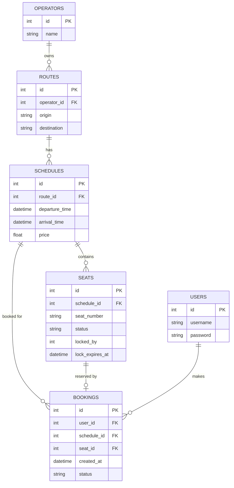

# Penjelasan Project — Mini Booking Service
### Panduan persiapan interview: setiap bagian dijelaskan 2 kali (versi teknis & versi sederhana)

Dokumen ini dibuat supaya Anda bisa menjelaskan project ini dengan percaya diri
saat interview — baik ke interviewer yang teknis maupun yang non-teknis.
Setiap bagian punya:
- **Versi Normal** — bahasa teknis yang tepat, cocok dijawab langsung ke interviewer engineer
- **Versi Sederhana** — analogi sehari-hari, untuk memastikan Anda benar-benar paham (bukan hafalan)

Baca kedua versi. Kalau Anda bisa jelaskan versi sederhananya dengan kata-kata
sendiri tanpa lihat teks, artinya Anda sudah benar-benar paham — bukan cuma hafal.

---

## 1. Apa masalah yang diselesaikan project ini?

**Versi Normal:**
Ini adalah simulasi sistem booking (terinspirasi dari Tiketux) yang menangani
tiga alur inti: pencarian jadwal, penguncian kursi sementara (seat locking),
dan konfirmasi pemesanan. Fokus utamanya adalah **concurrency handling** —
memastikan dua pengguna yang mencoba memesan kursi yang sama secara
bersamaan tidak berdua-duanya berhasil.

**Versi Sederhana:**
Bayangkan Anda dan teman Anda sama-sama buka aplikasi tiket kereta di HP
masing-masing, dan sama-sama pencet kursi nomor A1 di detik yang sama persis.
Kalau sistemnya buruk, bisa saja tiket A1 tercetak dua kali untuk dua orang
berbeda — itu masalah nyata yang pernah terjadi di sistem booking sungguhan.
Project ini dibuat khusus untuk membuktikan: sistem saya bisa menangani
situasi "rebutan" itu dengan benar, sehingga hanya satu orang yang menang.

---

## 2. Arsitektur besar: bagaimana semua bagian saling terhubung

**Versi Normal:**
Ini arsitektur client-server sederhana dengan 3 lapisan:
- **Frontend** (Vue 3 + Vite) — Single Page Application yang berjalan di
  browser, mengonsumsi REST API lewat Axios
- **Backend** (Go, `net/http` standar library) — menangani business logic,
  validasi, autentikasi, dan berkomunikasi dengan database
- **Database** (SQLite) — penyimpanan data transaksional

Komunikasi frontend↔backend murni lewat HTTP/JSON (REST API), tidak ada
shared state di antara keduanya — jadi frontend dan backend bisa dikembangkan
dan di-deploy terpisah.

**Versi Sederhana:**
Anggap seperti restoran:
- **Frontend** = meja & menu yang Anda lihat sebagai pelanggan (tampilan visual)
- **Backend** = dapur yang memproses pesanan Anda, memutuskan apakah bisa
  dipenuhi atau tidak
- **Database** = gudang bahan baku, tempat semua data (jadwal, kursi, siapa
  pesan apa) disimpan

Anda (browser) tidak pernah masuk ke dapur langsung — Anda selalu lewat
pelayan (API) yang mengirim permintaan dan membawa balik hasilnya.

---

## 3. Skema database: 5 tabel dan hubungannya

**Versi Normal:**
Skema dirancang mengikuti relasi berikut:



Kolom penting yang jadi kunci concurrency handling ada di tabel `seats`:
`status`, `locked_by`, dan `lock_expires_at`. Tiga kolom ini bersama-sama
menentukan apakah kursi bisa dikunci/dipesan saat ini.

**Versi Sederhana:**
Bayangkan 5 buku catatan terpisah yang saling merujuk:
1. **Operators** — buku daftar perusahaan travel (misalnya "Tiketux Air")
2. **Routes** — buku daftar rute (misalnya "Jakarta ke Bandung"), tiap rute
   dimiliki satu perusahaan
3. **Schedules** — buku daftar jadwal keberangkatan spesifik (misalnya "1
   Agustus jam 9 pagi"), tiap jadwal ikut satu rute
4. **Seats** — buku daftar kursi untuk tiap jadwal, ini yang paling penting:
   tiap kursi punya status (kosong/dikunci/terisi), dan kalau dikunci, dicatat
   siapa yang mengunci dan kapan kuncinya habis
5. **Bookings** — buku catatan siapa akhirnya berhasil pesan kursi mana

Semua saling terhubung lewat "nomor referensi" (ID) — persis seperti nomor
halaman yang saling dirujuk antar buku catatan.

---

## 4. Autentikasi: JWT (JSON Web Token)

**Versi Normal:**
Autentikasi memakai JWT stateless dengan skema access + refresh token:
- **Access token**: berlaku 15 menit, dipakai di header
  `Authorization: Bearer <token>` untuk endpoint yang dilindungi
- **Refresh token**: berlaku 24 jam, dipakai untuk menukar dengan access
  token baru tanpa perlu login ulang
- Token ditandatangani dengan algoritma HS256, memuat klaim `user_id`,
  `username`, dan `type` (`access` atau `refresh`) — klaim `type` mencegah
  refresh token dipakai langsung sebagai access token
- Server tidak menyimpan session di database — cukup verifikasi signature dan
  waktu kadaluwarsa token, sehingga stateless dan mudah di-scale

Middleware `RequireAuth` membungkus handler `lock` dan `confirm` saja,
sementara `search` dan `view seats` tetap publik sesuai requirement.

**Versi Sederhana:**
Bayangkan JWT seperti **gelang tiket masuk konser**:
- Saat Anda check-in (login), panitia kasih gelang (token) yang ada tanda
  tangan resmi panitia di dalamnya
- Untuk masuk area VIP (endpoint yang dilindungi seperti "kunci kursi"), Anda
  tinggal tunjukkan gelang — petugas cek tanda tangannya asli atau tidak,
  tanpa perlu telepon balik ke panitia pusat
- Gelang ini ada masa berlakunya (15 menit) — biar kalau hilang/dicuri,
  tidak bisa dipakai selamanya
- Ada juga "kartu tukar gelang baru" (refresh token) yang berlaku lebih lama
  (24 jam), jadi Anda tidak perlu antre check-in ulang tiap 15 menit

---

## 5. Penguncian kursi & penanganan race condition (bagian paling penting!)

Ini adalah jantung dari project ini — bagian yang paling mungkin ditanya
mendalam saat interview.

**Versi Normal:**
Alih-alih pola "read-then-write" (baca status kursi, cek kosong, baru update),
yang rentan race condition karena ada celah waktu antara baca dan tulis,
sistem ini memakai **atomic conditional UPDATE**:

```sql
UPDATE seats
SET status = 'locked', locked_by = ?, lock_expires_at = ?
WHERE id = ?
  AND (status = 'available' OR (status = 'locked' AND lock_expires_at < ?))
```

Query ini menyatukan "cek" dan "ubah" jadi satu operasi atomik di level
database. Database menjamin hanya satu `UPDATE` yang bisa mengubah baris
tertentu pada satu waktu (row-level locking bawaan mesin database). Jadi
kalau dua request datang bersamaan:
1. Request pertama yang diproses database akan berhasil mengubah baris
   (`status` dari `available` jadi `locked`)
2. Request kedua yang sampai setelahnya akan menemukan `WHERE`-nya tidak lagi
   cocok (karena `status` sudah bukan `available`), sehingga `RowsAffected`
   bernilai 0 → sistem tahu request ini harus ditolak dengan `409 Conflict`

Keunggulan pendekatan ini dibanding mutex/lock di level aplikasi (in-process
lock): jaminan konsistensi datang dari **database**, bukan dari memori satu
proses aplikasi. Ini penting karena kalau nanti backend di-scale jadi
beberapa instance/container (seperti di Docker Compose dengan multiple
replicas), mutex in-process tidak akan melindungi lintas instance — tapi
atomic UPDATE di database tetap melindungi karena semua instance berbicara ke
database yang sama.

Untuk konfirmasi booking, polanya serupa tapi dibungkus dalam **transaction**:
cek ulang siapa pemilik lock dan apakah masih valid, lalu di transaksi yang
sama, ubah status kursi jadi `booked` DAN insert baris booking — supaya kedua
perubahan itu tidak pernah "setengah jalan" (baik keduanya sukses, atau
keduanya gagal/rollback).

**Versi Sederhana:**
Bayangkan Anda dan teman berebut kursi terakhir di bioskop, dan kalian
berdua lapor ke **satu petugas loket yang sama** di waktu yang (hampir)
bersamaan.

Petugas ini punya aturan: dia hanya bisa melayani **satu orang dalam satu
waktu** — tidak peduli seberapa cepat dua orang bicara bersamaan, si petugas
tetap memproses satu per satu. Jadi meskipun Anda dan teman "berteriak"
bersamaan, petugas akan dengar salah satu duluan (katakanlah Anda), langsung
tandai kursi itu "sudah dipesan Anda", BARU dengar permintaan teman Anda —
dan karena kursi sudah tertulis "milik Anda", petugas langsung bilang ke
teman Anda "maaf, sudah diambil".

Yang membuat ini aman bukan karena petugasnya cepat, tapi karena **dia hanya
bisa mengerjakan satu hal dalam satu waktu, dan dia selalu cek papan status
kursi SAAT ITU JUGA sebelum bilang "oke"** — bukan cek dulu baru tulis nanti
(yang punya jeda waktu berbahaya), tapi cek-dan-tulis jadi satu gerakan yang
tidak bisa "diselak" orang lain di tengah jalan.

Saya sudah membuktikan ini bekerja dengan cara menembakkan 50 permintaan
"kunci kursi" secara bersamaan lewat skrip (`scripts/loadtest.go`) — hasilnya
selalu tepat 1 yang berhasil, 49 sisanya ditolak dengan pesan "kursi sudah
dikunci". Ini bukan klaim di atas kertas, tapi terbukti lewat pengujian nyata.

---

## 6. Auto-release lock setelah kedaluwarsa

**Versi Normal:**
Ada dua mekanisme pelepasan lock kedaluwarsa yang saling melengkapi:
1. **Background sweeper** (`handlers/sweeper.go`) — goroutine yang berjalan
   tiap 30 detik, menjalankan `UPDATE seats SET status='available' WHERE
   status='locked' AND lock_expires_at < NOW()` untuk semua kursi sekaligus
2. **Lazy release on read** — setiap kali endpoint `GET /schedules/{id}/seats`
   dipanggil, sistem lebih dulu melepas lock yang sudah kedaluwarsa untuk
   schedule tersebut, sebelum mengembalikan data — sehingga user tidak perlu
   menunggu sampai sweeper berikutnya jalan untuk melihat data akurat

Kombinasi keduanya memastikan data selalu konsisten: sweeper menjaga
konsistensi sistem secara keseluruhan meski tidak ada yang mengakses,
sementara lazy release menjamin akurasi real-time saat memang ada yang cek.

**Versi Sederhana:**
Bayangkan kursi yang dikunci itu seperti tiket parkir dengan timer 5 menit.
Ada dua cara timer itu "dicek":
1. Ada **petugas keliling** yang lewat tiap 30 detik, mengecek semua kursi,
   dan melepas yang timernya sudah habis — meski tidak ada yang nanya
2. Setiap kali **ada orang yang tanya** "kursi mana yang kosong?", sistem
   akan cek dulu apakah ada kursi yang timernya sudah habis sebelum jawab —
   supaya jawabannya selalu akurat, tidak perlu nunggu petugas keliling lewat

---

## 7. Rate limiting

**Versi Normal:**
`ratelimit/ratelimit.go` mengimplementasikan **token bucket** sederhana
per-IP, tanpa dependency eksternal: tiap IP punya "ember" berisi maksimal 10
token (burst capacity), terisi ulang 2 token/detik. Tiap request mengurangi 1
token; kalau ember kosong, request ditolak dengan `429 Too Many Requests`.
Ini diterapkan khusus di endpoint `search schedules` untuk mencegah abuse
(misalnya scraping berlebihan).

**Versi Sederhana:**
Bayangkan tiap pengunjung dapat "ember berisi 10 koin" untuk beli tiket
pencarian. Tiap kali mereka cari jadwal, satu koin terpakai. Koin terisi
ulang otomatis 2 keping tiap detik. Kalau koinnya habis dan mereka masih coba
cari lagi, mereka harus tunggu sampai koin terisi lagi — ini mencegah satu
orang "menyerbu" server dengan ribuan permintaan sekaligus dalam sedetik.

---

## 8. Testing: bagaimana saya membuktikan sistem ini benar

**Versi Normal:**
`main_test.go` berisi integration test memakai `httptest.Server` yang
menjalankan router asli (bukan mock), dengan database SQLite sementara yang
dibuat ulang tiap test (`t.Cleanup` untuk teardown). 6 skenario diuji:

1. `TestSuccessfulBooking` — alur lengkap search → lock → confirm
2. `TestLockConflict` — user kedua ditolak saat kursi sudah dikunci user pertama
3. `TestConcurrentLockingIsRaceFree` — 15 goroutine mengunci kursi yang sama
   secara paralel, assert tepat 1 yang sukses
4. `TestMissingOrInvalidToken` — endpoint terproteksi menolak request tanpa
   token / dengan token rusak
5. `TestLockExpiry` — mensimulasikan lock kedaluwarsa (mundurkan
   `lock_expires_at`), lalu buktikan kursi bisa dikunci user lain
6. `TestInvalidLoginCredentials` — login dengan password salah ditolak

Semua test juga lulus dengan `-race` flag (Go race detector), yang mendeteksi
data race di level memori — bukan cuma logic error.

**Versi Sederhana:**
Saya tidak cuma bilang "sistem ini aman dari rebutan kursi" — saya buktikan
lewat skenario nyata yang dijalankan otomatis tiap kali saya ubah kode:
- Coba pesan sampai selesai — harus berhasil
- Coba dua orang rebutan kursi yang sama — yang kedua harus ditolak
- Coba 15 orang rebutan bersamaan — harus tepat 1 yang menang
- Coba akses tanpa "gelang tiket" (token) — harus ditolak
- Coba pakai kursi yang kuncinya sudah lewat 5 menit — harus otomatis
  terlepas dan bisa diambil orang lain
- Coba login pakai password salah — harus ditolak

Kalau salah satu dari 6 hal ini gagal, saya akan langsung tahu sebelum
project ini "dianggap selesai" — bukan menunggu ketahuan pas dipakai orang.

---

## 9. Struktur frontend (Vue 3)

**Versi Normal:**
Frontend adalah SPA (Single Page Application) dengan struktur:
- **`api/client.js`** — instance Axios dengan interceptor: otomatis
  menyisipkan access token ke header tiap request, dan otomatis mencoba
  refresh token sekali kalau dapat respons 401 sebelum menyerah
- **`store/auth.js`** — state management sederhana pakai Vue `reactive()`
  (tidak perlu Vuex/Pinia untuk scope sekecil ini), menyimpan status login
- **`router/index.js`** — Vue Router dengan navigation guard: route yang
  butuh login (`SeatSelection`, `BookingSummary`, `Confirmation`) otomatis
  redirect ke `/login` kalau belum ada token
- **`views/`** — 5 halaman mengikuti alur linear: Login → Search →
  SeatSelection → BookingSummary → Confirmation, tiap halaman adalah
  komponen Vue terpisah dengan `<script setup>` (Composition API)

**Versi Sederhana:**
Frontend dibagi jadi "departemen" kecil yang masing-masing punya tugas
spesifik, biar gampang di-maintain:
- Satu bagian khusus ngurusin "cara ngomong ke server" (api client)
- Satu bagian khusus "inget siapa yang lagi login" (store)
- Satu bagian khusus "atur halaman mana yang boleh diakses siapa" (router)
- Lima halaman terpisah yang jalan berurutan seperti alur nyata pesan tiket:
  login dulu → cari jadwal → pilih kursi → cek ringkasan → lihat hasil akhir

---

## 10. Docker (containerization)

**Versi Normal:**
Backend dan frontend masing-masing punya `Dockerfile` multi-stage:
- **Backend**: stage build pakai `golang:1.22-bookworm` (include gcc untuk
  cgo/sqlite3), stage runtime pakai `debian:bookworm-slim` yang lebih ringan
  — hanya binary hasil compile yang dibawa ke image final
- **Frontend**: stage build pakai `node:20` untuk `npm run build`, stage
  runtime pakai `nginx:alpine` untuk serve static file hasil build, dengan
  `nginx.conf` yang mengarahkan semua route ke `index.html` (diperlukan
  karena Vue Router pakai history mode)
- `docker-compose.yml` menyatukan keduanya plus named volume untuk database
  agar data tidak hilang saat container di-restart

**Versi Sederhana:**
Docker itu seperti "kotak kemasan siap saji" — semua yang dibutuhkan program
(Go, library, dependency) dibungkus jadi satu paket yang bisa dijalankan di
komputer manapun tanpa perlu install Go/Node/gcc manual satu-satu. Tinggal
`docker compose up`, dan semuanya otomatis ter-install dan jalan di dalam
"kotak" masing-masing.

---

## 11. Pertanyaan interview yang mungkin muncul (dan cara jawabnya)

**Q: "Kenapa pakai atomic UPDATE, bukan mutex/lock biasa?"**
> Mutex hanya melindungi dalam satu proses aplikasi. Kalau nanti backend
> di-scale jadi beberapa instance (misalnya di Kubernetes atau beberapa
> container), tiap instance punya memori sendiri-sendiri, jadi mutex di satu
> instance tidak tahu-menahu soal instance lain. Atomic UPDATE di database
> bekerja di level yang lebih rendah dan lebih terjamin: semua instance
> bicara ke database yang sama, jadi database-lah yang jadi "wasit tunggal".

**Q: "Bagaimana kalau dua request benar-benar sampai di waktu yang IDENTIK?"**
> Di level hardware/OS, tidak ada dua operasi tulis yang benar-benar terjadi
> di waktu identik — selalu ada urutan, walau bedanya nanodetik. Database
> menjamin isolasi lewat locking di level baris data (row-level lock), jadi
> siapa pun yang "sampai" duluan (walau selisihnya sangat kecil) akan
> diproses lebih dulu, dan yang kedua otomatis menemukan kondisi sudah
> berubah.

**Q: "Kenapa access token cuma 15 menit? Bukannya merepotkan?"**
> Trade-off keamanan vs kenyamanan. Token pendek mengurangi risiko kalau
> token dicuri (kesempatan pakainya kecil). Supaya user tidak perlu login
> ulang tiap 15 menit, ada refresh token yang lebih tahan lama (24 jam) dan
> proses refresh-nya otomatis di frontend, user tidak akan merasakannya
> selama masih aktif pakai aplikasi.

**Q: "Apa kelemahan/keterbatasan project ini kalau mau dipakai production?"**
> Beberapa hal yang saya sadari perlu ditingkatkan untuk production:
> - Password disimpan plaintext (untuk demo ini disengaja sesuai requirement
>   user dummy) — production wajib hash pakai bcrypt/argon2
> - SQLite cukup untuk demo, tapi untuk trafik tinggi lebih cocok
>   Postgres dengan `SELECT ... FOR UPDATE`
> - Rate limiter in-memory reset kalau server restart dan tidak sinkron
>   antar banyak instance — production sebaiknya pakai Redis
